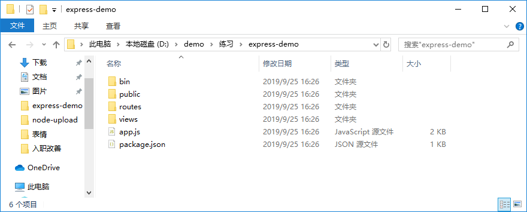
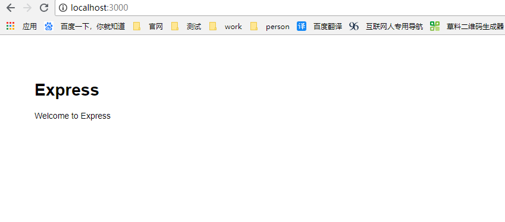
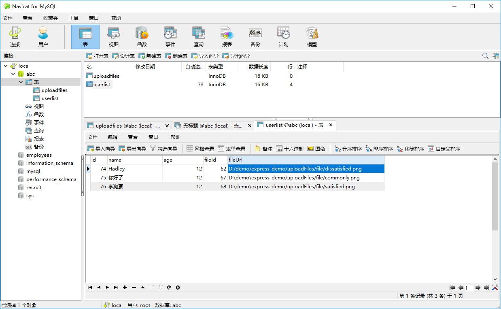
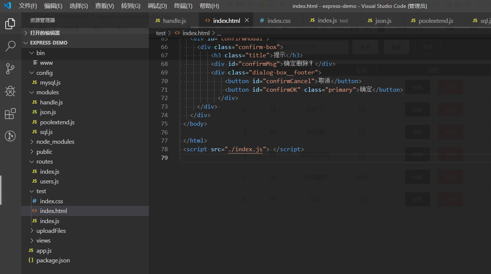
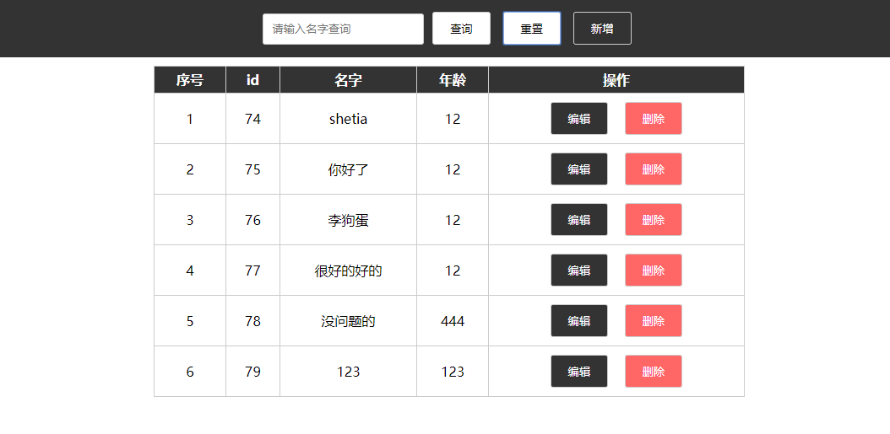
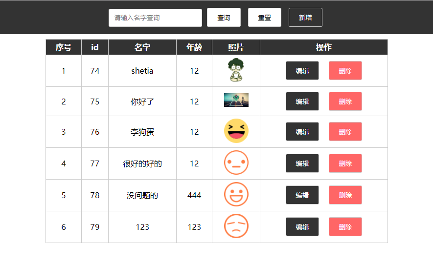

##本demo创建流程


### 前言

最近想学习一下node.js, 实现一个增删改查和文件上传接口。

### 起步

node的安装及mysql的安装我在这里，就不详细说明了，详情请查看菜鸟教程，有详细的教程。
既然用到express，我们就先去express官网看看,发现有个[Express 应用程序生成器](http://www.expressjs.com.cn/starter/generator.html),
我们就跟着它来创建一个应用骨架,下面我们先安装express-generator
```
npm install express-generator -g
```
然后运行下面这句就可以创建一个应用骨架了
```
express --view=pug express-demo
```
效果如图：


然后安装依赖
```
cnpm i
```
之后就可以运行服务了
```
npm start
```
去浏览器打开localhost:3000,就会看到如下图：

到这里基本骨架就完成了，接下来我们就要修改项目结构，实现前后端增删改查了。

### 增删改查

#### 修改目录结构

在根目录下创建几个文件夹，
```
...
|——config
      |——mysql.js 
|——modules
      |——handle.js
      |——json.js
      |——poolextend.js
      |——sql.js
|——test
      |——index.css
      |——index.html
      |——index.js 
...
```
下面是具体代码
封装数据库配置
```js
/* config/mysql.js */

// MySQL数据库联接配置封裝
var mysql = {
  host: 'localhost',
  user: 'root',
  password: 'root',
  database: 'abc',
  port: 3306
};
module.exports = mysql;
```
具体逻辑封装
```js
 /* modules/handle.js */
/*
    数据增删改查模块封装
    req.query 解析GET请求中的参数 包含在路由中每个查询字符串参数属性的对象，如果没有则为{}
    req.params 包含映射到指定的路线“参数”属性的对象,如果有route/user/：name，那么“name”属性可作为req.params.name
    req.body通常用来解析POST请求中的数据
     +req.query.id 可以将id转为整数
 */
// 引入mysql
var mysql = require('mysql');
// 引入mysql连接配置
var mysqlconfig = require('../config/mysql');
// 引入连接池配置
var poolextend = require('./poolextend');
// 引入SQL模块
var sql = require('./sql');
// 引入json模块
var json = require('./json');
var fs = require('fs'); 
// 使用连接池，提升性能
var pool = mysql.createPool(poolextend({}, mysqlconfig));
var userData = {
    add: function (req, res, next) {
        pool.getConnection(function (err, connection) {
            var param = req.query || req.params; 
            connection.query(sql.insert, [param.id, param.name, param.age, ], function (err, result) {
                if (result) {
                    result = 'add'
                }
                // 以json形式，把操作结果返回给前台页面
                json(res, result);
                // 释放连接
                connection.release();
            });
        });
    },
    delete: function (req, res, next) {
        pool.getConnection(function (err, connection) {
            var id = +req.query.id;
            connection.query(sql.delete, id, function (err, result) {
                if (result.affectedRows > 0) {
                    result = 'delete';
                } else {
                    result = undefined;
                }
                json(res, result);
                connection.release();
            });
        });
    },
    update: function (req, res, next) {
        var param = req.body;
        if (param.name == null || param.age == null || param.id == null) {
            json(res, undefined);
            return;
        }
        pool.getConnection(function (err, connection) {
            connection.query(sql.update, [param.name, param.age, +param.id], function (err, result) {
                if (result.affectedRows > 0) {
                    result = 'update'
                } else {
                    result = undefined;
                }
                json(res, result);
                connection.release();
            });
        });
    },
    queryById: function (req, res, next) {
        var id = +req.query.id;
        pool.getConnection(function (err, connection) {
            connection.query(sql.queryById, id, function (err, result) {
                if (result != '') {
                    var _result = result;
                    result = {
                        result: 'select',
                        data: _result
                    }
                } else {
                    result = undefined;
                }
                json(res, result);
                connection.release();
            });
        });
    },
    queryByName: function (req, res, next) {
        var name = req.query.name;
        pool.getConnection(function (err, connection) {
            connection.query(sql.queryByName, name, function (err, result) {
                if (result != '') {
                    var _result = result;
                    result = {
                        result: 'select',
                        data: _result
                    }
                } else {
                    result = undefined;
                }
                json(res, result);
                connection.release();
            });
        });
    },
    queryAll: function (req, res, next) { 
        pool.getConnection(function (err, connection) {
            connection.query(sql.queryAll, function (err, result) {
                if (result != '') {
                    var _result = result;
                    result = {
                        result: 'selectall',
                        data: _result
                    }
                } else {
                    result = undefined;
                }
                json(res, result);
                connection.release();
            });
        });
    }, 
};
module.exports = userData;
```

响应数据封装
```js
//json.js
//封装接送模块
var json = function(res, result) {
  if (typeof result === 'undefined') {
      res.json({
          code: '1',
          msg: '操作失败'
      });
  } else if (result === 'add') {
      res.json({
          code: '200',
          msg: '添加成功'
      });
  } else if (result === 'delete') {
      res.json({
          code: '200',
          msg: '删除成功'
      });
  } else if (result === 'update') {
      res.json({
          code: '200',
          msg: '更改成功'
      });
  } else if (result.result != 'undefined' && result.result === 'select') {
      res.json({
          code: '200',
          msg: '查找成功',
          data: result.data
      });
  } else if (result.result != 'undefined' && result.result === 'selectall') {
      res.json({
          code: '200',
          msg: '全部查找成功',
          data: result.data
      });
  } else {
      res.json(result);
  }
};
module.exports = json;
```

连接池封装
```js
//poolextent.js
// 连接池扩展封装
var poolextend = function(target, source, flag) {
  for (var key in source) {
      if (source.hasOwnProperty(key)) {
          flag ? (target[key] = source[key]) : (target[key] === void 0 && (target[key] = source[key]));
      }
  }
  return target;
}
module.exports = poolextend;
```

sql语句封装
```js
//sql.js
// SQL语句封裝
var user = {
  insert:'INSERT INTO userlist(id, name, age) VALUES(?,?,?,?,?)',
  update:'UPDATE userlist SET name=?, age=? WHERE id=?',
  delete: 'DELETE FROM userlist WHERE id=?',
  queryById: 'SELECT * FROM userlist WHERE id=?',
  queryByName: `SELECT * FROM userlist WHERE name LIKE CONCAT('%',?,'%')`,
  queryAll: 'SELECT * FROM userlist',
};
module.exports = user;
```

然后路由文件我们要修改一下
```js
 
//router/index.js
var express = require('express');
var router = express.Router();
var user = require('../modules/handle');

/* GET users listing. */
router.get('/', function(req, res, next) {
  res.render('index', { title: 'SQL for MySQL' });
});
router.get('/addUser', function(req, res, next) {
    user.add(req, res, next);
});
router.get('/queryAll', function(req, res, next) { 
    user.queryAll(req, res, next);
});

router.get('/query', function(req, res, next) {
    user.queryById(req, res, next);
});
router.get('/queryName', function(req, res, next) {
    user.queryByName(req, res, next);
});
router.get('/deleteUser', function(req, res, next) {
    user.delete(req, res, next);
});
router.get('/update', function(req, res, next) {
    res.render('update');
});
router.post('/updateUser', function(req, res, next) {
    user.update(req, res, next);
});
 
module.exports = router;
```

app文件我们设置一下，允许跨域
```js
var createError = require('http-errors');
var express = require('express');
var path = require('path');
var cookieParser = require('cookie-parser');
var logger = require('morgan');

var indexRouter = require('./routes/index');
var usersRouter = require('./routes/users'); 

var app = express();
//设置允许跨域访问该服务.
app.all('*', function (req, res, next) {
  res.header('Access-Control-Allow-Origin', '*');
  //Access-Control-Allow-Headers ,可根据浏览器的F12查看,把对应的粘贴在这里就行
  res.header('Access-Control-Allow-Headers', 'Content-Type');
  res.header('Access-Control-Allow-Methods', '*');
  res.header('Content-Type', 'application/json;charset=utf-8');
  next();
});
// view engine setup
app.set('views', path.join(__dirname, 'views'));
app.set('view engine', 'jade');

app.use(logger('dev'));
app.use(express.json());
app.use(express.urlencoded({
  extended: false
}));
app.use(cookieParser());
app.use(express.static(path.join(__dirname, 'public')));

app.use('/', indexRouter);
app.use('/users', usersRouter); 

// catch 404 and forward to error handler
app.use(function (req, res, next) {
  next(createError(404));
});

// error handler
app.use(function (err, req, res, next) {
  // set locals, only providing error in development
  res.locals.message = err.message;
  res.locals.error = req.app.get('env') === 'development' ? err : {};

  // render the error page
  res.status(err.status || 500);
  res.render('error');
}); 
module.exports = app;
 
```

接下来需要安装几个依赖
```
cnpm i mysql -S

cnpm i multer -S
```

到这里后端的增删改查就差不多了，接下来就是前端代码了
```html
  <!-- test/index.html -->
<!DOCTYPE html>
<html lang="en">

<head>
  <meta charset="UTF-8">
  <meta name="viewport" content="width=device-width, initial-scale=1.0">
  <meta http-equiv="X-UA-Compatible" content="ie=edge">
  <title>Document</title>
  <link rel="stylesheet" type="text/css" href="./index.css" />
</head>

<body>
  <div class="handler">
    <input type="text" id="searchValue" placeholder="请输入名字查询">
    <button id="searchBtn">查询</button>
    <button id="resetBtn">重置</button>
    <button id="addBtn" class="primary">新增</button>
    
  </div>
  <div class="table-box">
    <table  border="0" cellspacing="0" cellpadding="0" id="box">
    </table>
  </div>
  <!-- 新增弹框 -->
  <div id="modal">
    <div class="dialog-box">
      <div class="dialog-box__main">
        <div class="main-item">
          <label for="">名字</label>
          <input type="text"  placeholder="请输入名字" id="nameValue">
        </div>
        <div class="main-item">
          <label for="" >年龄</label>
          <input type="text" placeholder="请输入数字" id="ageValue">
        </div> 
      </div>
      <div class="dialog-box__footer">
        <button id="cancelBtn">取消</button>
        <button id="confirmBtn" class="primary">确定</button>
      </div>
    </div>
  </div>
  <!-- 提示tips -->
  <div id="tips">
  </div>
  <!-- 确定弹框 -->
  <div id="confirmModal">
    <div class="confirm-box">
        <h3 class="title">提示</h3>
        <div id="confirmMsg">确定删除？</div>
        <div class="dialog-box__footer">
            <button id="confirmCancel">取消</button>
            <button id="confirmOK" class="primary">确定</button>
          </div>
    </div> 
  </div>
</body>

</html>
<script src="./index.js"> </script> 

```

```css
/* test/index.css */
*{
  padding: 0;
  margin: 0;
} 
html,
body {
  padding: 0;
  margin: 0;
  width: 100%;
  height: 100%;
  overflow: hidden;
}
/* 新增弹框 */
#modal {
  width: 100%;
  height: 100%;
  background: rgba(0, 0, 0, .8);
  position: fixed;
  top: 0px;
  left: 0px;
  display: none;
  transition:all 1s;
  z-index: 99;
}

.dialog-box {
  min-width: 300px;
  /* height: 200px; */
  background: #ffffff;
  border-radius: 3px;
  padding: 10px 10px 80px;
  position: absolute;
  top: 50%;
  left: 50%;
  transform: translate(-50%, -50%); 
  transition:all 1s;
}
#fileBtn{
  display:none;
}
#fileAdd{
  width:50px;
  height:50px;
  border:2px solid #ccc;
  position: relative;
  cursor: pointer;
  transition:all .5s;
}
#fileAdd:hover{
  box-shadow: 0px 0px 0px 50px #eee inset;
  color:#fff;
}
#fileAdd::before{
  content:'';
  display: inline-block;
  width:20px;
  height: 2px;
  background:#ccc;
  position: absolute;
  top:50%;
  left:50%;
  transform: translate(-50%,-50%);
}
#fileAdd::after{
  content:'';
  display: inline-block;
  width:2px;
  height: 20px;
  background:#ccc;
  position: absolute;
  top:50%;
  left:50%;
  transform: translate(-50%,-50%);
}
.dialog-box__main{
  margin-top: 30px;
}
.dialog-box__footer {
  position: absolute;
  bottom: 10px;
  right: 10px;

}

.dialog-box__footer button {
  cursor: pointer;
}

/* 新增弹框样式 结束 */
button {
  border: none;
  background: #fff;
  border-radius: 3px;
  padding: 10px 20px;
  border: 1px solid #ccc;
  margin: 5px;
  cursor: pointer;
}

button:hover{
  opacity: 0.8;
}
.primary {
  background: #333;
  color: #fff;
}
.danger{
  background: #ff6666;
  color: #fff;
}
.main-item {
  display: flex;
  align-items: center;
  justify-content: start;
  margin-bottom: 10px;
}
.main-item label{
  margin-right:10px;
  width:100px;
}
input {
  border-radius: 3px;
  padding: 10px 10px;
  border: 1px solid #ccc;
}

#tips {
  position: fixed;
  top: 88px;
  left: 50%;
  transform: translateX(-50%);
  width: auto;
  padding: 5px 20px;
  border-radius: 10px;
  color: #fff;
  transition: all 1s;
  display: none;
  z-index: 999;
}

.table-box {
  overflow-y: scroll;
  max-width: 700px;
  height: 600px;
  overflow: auto;
  text-align: center;
  margin:10px auto;
  position: relative;
}
.table-header{
  position: -webkit-sticky;
  position: sticky;
  top:0px;
  color:#fff;
  background:#333;
}
.table-box table {
    width:100%;
}

.handler {   
  padding:10px;
  text-align: center;
  background:#333;
}
/* 自定义表格 */
#tableList{ 
  border-bottom:none;
  min-width: 600px;
  display:flex;
  flex-direction: column;  
  border-right:1px solid #ccc;
  box-sizing:border-box;
}
.list-item{
  border-bottom:1px solid #ccc;
  display:flex;
  justify-content: space-around;
  align-items:center;
  height: 50px;
  line-height: 50px;
} 
.list-item span{
  width:100%;
  flex:1;
  display:block;
  height: 100%;
  border-left:1px solid #ccc;
  overflow: hidden;
  /*设置文本框大小*/
  white-space: nowrap;
  /*设置内容不换行*/
  text-overflow: ellipsis;
  /*设置文字超出文本框的内容显示成...*/
}
.list-item .list-handler{
    flex:2;
}
.empty-text{
  line-height: 40px;
  border-left:1px solid #ccc;
  border-bottom:1px solid #ccc;
}


#box{
  border: 1px solid #ccc;
  border-bottom:none;
  min-width: 600px;
}

#box tr th,#box tr td{
  border-bottom:1px solid #ccc;
  border-right:1px solid #ccc;
  padding:5px 10px;
}
#box tr th{
  background:#333;
  color:#fff;
}
#box tr th:last-child,#box tr td:last-child{ 
  border-right:none;
}


/* 确定弹框 */
#confirmModal{
  width: 100%;
  height: 100%;
  background: rgba(0, 0, 0, .8);
  position: fixed;
  top: 0px;
  left: 0px;
  display: none;
  transition:all 1s;
}
.confirm-box {
  width: 300px;
  height: 200px;
  background: #ffffff;
  border-radius: 3px;
  padding: 10px;
  position: absolute;
  top: 50%;
  left: 50%;
  transform: translate(-50%, -50%); 
  transition:all 1s;
}
#confirmMsg{
  font-size:16px;
  text-align:center;
  margin-top:40px;
}
.title{
  font-size:18px;
  text-align:center;
}
```


```js
 /* test/index.js */
    function queryDom(name){
      return document.querySelector(name)
    }
    let dialogBox = queryDom('.dialog-box')
    let confirmModal = queryDom('#confirmModal')
    let confirmMsg = queryDom('#confirmMsg')
    let confirmCancel = queryDom('#confirmCancel')
    let confirmOK = queryDom('#confirmOK')
    let searchBtn = queryDom('#searchBtn')
    let resetBtn = queryDom('#resetBtn')
    let searchValue = queryDom('#searchValue')
    let box = queryDom('#box')
    let nameValue = queryDom('#nameValue')
    let ageValue = queryDom('#ageValue')
    let addBtn = queryDom('#addBtn')
    let confirmBtn = queryDom('#confirmBtn')
    let cancelBtn = queryDom('#cancelBtn')
    let modal = queryDom('#modal')
    let tipsBox = queryDom('#tips')
    let delBtn = queryDom('.addBtn') 
    // 约定一个变量控制是新增还是编辑
    let flag = 'add'
    let gobj = {}  // 用来临时存储编辑数据 
    // 页面加载的时候查询一次列表
    window.onload = function () {
      getList()
    }
    /* ------------------点击事件部分---------------------------- */
    searchBtn.onclick = function () {
      getListByName(searchValue.value)
    }
    // 重置
    resetBtn.onclick = function () {
      searchValue.value = ''
      getList()
    }
    // 编辑和删除
    box.onclick = function (e) { 
      if (e.target.className.indexOf('updateBtn')>-1) {
        modal.style.display = 'block' 
        modal.style.opacity = 1
        dialogBox.style.left = '50%'
        flag = 'edit'
        let obj = JSON.parse(e.target.getAttribute('data-item'))
        gobj = obj 
        detail(obj)
      } else if (e.target.className.indexOf('delBtn')>-1) {
        let id = e.target.getAttribute('data-id')

        confirmBox('此操作会删除该行数据，是否确定？').then(function(){
          del(id)
        }).catch(function(){
          console.log('取消删除')
        })
      }
    }

    function detail(item) {
      nameValue.value = item.name
      ageValue.value = item.age
    }

    // 新增
    addBtn.onclick = function () {
      modal.style.display = 'block'
      modal.style.opacity = 1
      dialogBox.style.left = '50%'
      flag = 'add'
      nameValue.value = ''
      ageValue.value = '' 
    }
    


    // 取消
    cancelBtn.onclick = function () {
      setTimeout(function() {
        modal.style.display = 'none'
      }, 1000);
      modal.style.opacity = 0
      dialogBox.style.left = '-300px'
    }
    // 确定
    confirmBtn.onclick = function () { 
      // 校验不能为空
      if(!ageValue.value||!nameValue.value ){
        tips.error('不能为空')
        return
      }
      // 校验年龄是否为数字
      if(!/^\d*$/g.test(ageValue.value)){
        tips.error('年龄请输入数字')
        return
      }
      setTimeout(function() {
        modal.style.display = 'none'
      }, 1000);
      modal.style.opacity = 0
      dialogBox.style.left = '-300px'
      if (flag === 'add') {
        add()
      } else if (flag === 'edit') {
        update(gobj.id)
      }
    }
    /* ------------------点击事件部分---------------------------- */

    

    /* ------------------请求部分 开始--------------------------------- */
    //  删除数据
    function del(id) {
      _ajax({
        url: 'http://localhost:3000/deleteUser',
        data: {
          id: id,
        },
        success: function (res) {
          if (res.code === '200') {
            tips.success(res.msg)
            getList()
          } else {
            tips.error(res.msg)
          }
        },
        error: function (e) {
          console.log(e, 'error')
        }
      })
    }
    // 获取全部数据
    function getList() { 
      _ajax({
        url: 'http://localhost:3000/queryAll',
        success: function (res) {
          let resData = res.data || []
          if (resData) { 
              renderTable(resData) 
          }

        },
        error: function (e) {
          console.log(e, 'error')
        }
      })
    }
    // 根据name查询数据
    function getListByName(name) { 
      _ajax({
        url: 'http://localhost:3000/queryName',
        data: {
          name: name
        },
        success: function (res) {
          let resData = res.data || []
          if (resData) {
            renderTable(resData)
          } 
        },
        error: function (e) {
          console.log(e, 'error')
        }
      })
    }
    // 新增数据
    function add() {
      _ajax({
        url: 'http://localhost:3000/addUser',
        data: {
          name: nameValue.value,
          age: ageValue.value, 
        },
        success: function (res) {
          if (res.code === '200') {
            tips.success(res.msg)
            getList()
          } else {
            tips.error(res.msg)
          }
        },
        error: function (e) {
          console.log(e, 'error')
        }
      })
    }
    // 更新数据
    function update(id) {
      _ajax({
        url: 'http://localhost:3000/updateUser',
        method: 'POST',
        data: {
          id: id,
          name: nameValue.value,
          age: ageValue.value, 
        },
        success: function (res) {
          if (res.code === '200') {
            tips.success(res.msg)
            getList()
          } else {
            tips.error(res.msg)
          }
        },
        error: function (e) {
          console.log(e, 'error')
        }
      })
    }
    /* ------------------请求部分结束------------------------------------- */

    // 封装渲染表格函数
    function renderTable(list){
      // 清空之前的表格
      box.innerHTML = ''
      // 添加个头部
      let headerTrNode = document.createElement('tr')
      headerTrNode.innerHTML = `
        <th>序号</th>
        <th>id</th>
        <th>名字</th>
        <th>年龄</th> 
        <th>操作</th>
      `
      box.appendChild(headerTrNode) 
      // 根据数据渲染表格体
      list.forEach((item,index)=>{
        let trNode = document.createElement('tr')
        trNode.innerHTML = `
          <td>${index+1}</td> 
          <td>${item.id}</td>
          <td>${item.name}</td>
          <td>${item.age}</td> 
          <td  >
            <button class="updateBtn primary"  data-item='${JSON.stringify(item)}'>编辑</button>&nbsp;
            <button class="delBtn danger" data-id="${item.id}">删除</button>
          </td>`
        box.appendChild(trNode)
      })
    }
    // 封装请求函数
    function _ajax(option) {
      let url = option.url || ''
      let method = option.method ? option.method.toUpperCase() : 'GET'
      let data = option.data || null

      // 把请求参数变成表单格式
      var formData = []
      for (var key in data) {
        formData.push(''.concat(key, '=', data[key]))
      }
      data = formData.join('&')
      if (method === 'GET') {
        url += location.search.length === 0 ? ''.concat('?', data) : ''.concat('&', data)
      }
      let xhr = new XMLHttpRequest()
      xhr.open(method, url, true)
      // 设置响应参数为传入的格式或者默认json格式
      xhr.responseType = option.responseType || 'json'
      xhr.onreadystatechange = () => {
        if (xhr.readyState === 4) {
          if (xhr.status === 200) {
            option.success(xhr.response)
          } else {
            option.error()
          }
        }
      }

      if (method === 'POST') {
        //设置发送数据的请求格式为表单格式
        // xhr.setRequestHeader('Content-Type', 'application/x-www-form-urlencoded')
        // 设置发送数据的请求格式为json格式
        xhr.setRequestHeader('content-type', 'application/json');
      }
      xhr.send(method === 'POST' ? JSON.stringify(option.data) : null)
    } 


/* ----------------工具函数部分-------------- */
    // 封装个提示函数
    function Tips() {
      
      var loop
      this.error = function (str, delay) {
        if(loop){
          clearTimeout(loop)
        }
        tipsBox.style.display = 'block'
        tipsBox.style.background = '#ff6666'
        tipsBox.innerHTML = str
        loop = setTimeout(() => {
          tipsBox.style.display = 'none'
        }, delay || 3000)
      }
      this.success = function (str, delay) {
        if(loop){
          clearTimeout(loop)
        }
        tipsBox.style.display = 'block'
        tipsBox.style.background = '#78d626'
        tipsBox.innerHTML = str
      loop = setTimeout(() => {
          tipsBox.style.display = 'none'
        }, delay || 3000)
      }

    }
    let tips = new Tips()
    // 封装个二次确认弹框
    function confirmBox(msg){
      msg = msg || '确定删除？'
      confirmMsg.innerHTML = msg
      confirmModal.style.display = 'block'
      return new Promise(function (resolve,reject) {
        confirmOK.onclick = function(){ 
          confirmModal.style.display = 'none' 
          resolve()
        }
        confirmCancel.onclick = function(){ 
          confirmModal.style.display = 'none'
          reject()
        }
      });
      
    }
    /* ----------------工具函数部分-------------- */
```
修改完后，我们来数据库创建一个表userlist和uploadfiles,这里我和文件上传的一起建了。没有什么影响的。


然后回到项目，重启一下服务
```
npm start
```
到这里前后端的增删改查就完成了，我们来看一下修改完的目录结构：


用浏览器打开，test目录下的index.html文件，看一下效果图：


增删改查相对来说简单点，所以文件上传我放到后面来

### 文件上传

话全在代码里了，我们直接上代码。为了好粘贴复制，我直接上全的代码，不用东拼西凑的。太折腾人了。
先往sql.js添加一条sql语句，顺便修改新增，修改语句
```js
//sql.js
// SQL语句封裝
var user = {
  insert:'INSERT INTO userlist(id, name, age,fileId,fileUrl) VALUES(?,?,?,?,?)',
  update:'UPDATE userlist SET name=?, age=?,fileId=?,fileUrl=? WHERE id=?',
  delete: 'DELETE FROM userlist WHERE id=?',
  queryById: 'SELECT * FROM userlist WHERE id=?',
  queryByName: `SELECT * FROM userlist WHERE name LIKE CONCAT('%',?,'%')`,
  queryAll: 'SELECT * FROM userlist',
  upload:'INSERT INTO uploadfiles(fieldname, originalName, tmpName, encoding, mimetype, size, path, tmpPath, addTime) VALUES(?,?,?,?,?,?,?,?,?)'
};
module.exports = user;

```

然后在handle.js 添加上传逻辑，顺便修改新增，修改接口
```js
 
/*
    数据增删改查模块封装
    req.query 解析GET请求中的参数 包含在路由中每个查询字符串参数属性的对象，如果没有则为{}
    req.params 包含映射到指定的路线“参数”属性的对象,如果有route/user/：name，那么“name”属性可作为req.params.name
    req.body通常用来解析POST请求中的数据
     +req.query.id 可以将id转为整数
 */
// 引入mysql
var mysql = require('mysql');
// 引入mysql连接配置
var mysqlconfig = require('../config/mysql');
// 引入连接池配置
var poolextend = require('./poolextend');
// 引入SQL模块
var sql = require('./sql');
// 引入json模块
var json = require('./json');
var fs = require('fs');
var globalObj = require('../config')  
// 使用连接池，提升性能
var pool = mysql.createPool(poolextend({}, mysqlconfig));
var userData = {
    add: function (req, res, next) {
        pool.getConnection(function (err, connection) {
            var param = req.query || req.params; 
            connection.query(sql.insert, [param.id, param.name, param.age,param.fileId,param.fileUrl], function (err, result) {
                if (result) {
                    result = 'add'
                }
                // 以json形式，把操作结果返回给前台页面
                json(res, result);
                // 释放连接
                connection.release();
            });
        });
    },
    delete: function (req, res, next) {
        pool.getConnection(function (err, connection) {
            var id = +req.query.id;
            connection.query(sql.delete, id, function (err, result) {
                if (result.affectedRows > 0) {
                    result = 'delete';
                } else {
                    result = undefined;
                }
                json(res, result);
                connection.release();
            });
        });
    },
    update: function (req, res, next) {
        var param = req.body;
        if (param.name == null || param.age == null || param.id == null) {
            json(res, undefined);
            return;
        }
        pool.getConnection(function (err, connection) {
            connection.query(sql.update, [param.name, param.age,param.fileId,param.fileUrl, +param.id], function (err, result) {
                if (result.affectedRows > 0) {
                    result = 'update'
                } else {
                    result = undefined;
                }
                json(res, result);
                connection.release();
            });
        });
    },
    queryById: function (req, res, next) {
        var id = +req.query.id;
        pool.getConnection(function (err, connection) {
            connection.query(sql.queryById, id, function (err, result) {
                if (result != '') {
                    var _result = result;
                    result = {
                        result: 'select',
                        data: _result
                    }
                } else {
                    result = undefined;
                }
                json(res, result);
                connection.release();
            });
        });
    },
    queryByName: function (req, res, next) {
        var name = req.query.name;
        pool.getConnection(function (err, connection) {
            connection.query(sql.queryByName, name, function (err, result) {
                if (result != '') {
                    var _result = result;
                    result = {
                        result: 'select',
                        data: _result
                    }
                } else {
                    result = undefined;
                }
                json(res, result);
                connection.release();
            });
        });
    },
    queryAll: function (req, res, next) { 
        pool.getConnection(function (err, connection) {
            connection.query(sql.queryAll, function (err, result) {
                if (result != '') {
                    var _result = result;
                    result = {
                        result: 'selectall',
                        data: _result
                    }
                } else {
                    result = undefined;
                }
                json(res, result);
                connection.release();
            });
        });
    },
    upload: function (req, res, next) { 
      var des_file =  "uploadFiles/file/" + req.originalname;
      fs.readFile(req.path, function (error, data) {
        if (error) {
            return console.error(error);
        }
        fs.writeFile(des_file, data, function (err) {
          if (err) {
              // 接收失败
              console.log("----------接收失败----------\n");
              console.log(err);
          }else {
            // 接收成功
            // 删除缓存文件
            fs.unlink(req.path, function(err){
                if (err){
                  console.log('文件:'+req.path+'删除失败！');
                    return console.error(err);
                } 
            })
            // 将文件信息写入数据库
            var time = new Date().toJSON(); 
            // 前端传过来的参数
            var addSqlParams = [
              req.fieldname, 
              req.originalname, 
              req.filename,
              req.encoding,
              req.mimetype, 
              req.size, 
              des_file, 
              __dirname + '/' + req.path, 
              time
            ] 
            // 插入数据
            pool.getConnection(function (err, connection) {
              connection.query(sql.upload, addSqlParams, function (err, result) {
                  if (err) {
                      return console.error(err);
                  }else { 
                      var response = {
                        status:200,
                        message: '上传成功!',
                        data:{
                          id:result.insertId,
                          path:globalObj.rootDir+ '/' + des_file,
                          fileName:req.filename,
                          time:time,
                          type:req.mimetype,
                          size:req.size, 
                        }
                      };
                      res.json( response );
                      connection.release();
                  }
              })
            })
          }
        })
      })
       
    }
};
module.exports = userData;
```

这个globalObj，是我在根目录新建了个config.js文件,就是为了拿一下根目录的绝对路径，没其他别的意思。咱们继续。
```js
const globalObj = {
  rootDir:__dirname
}

module.exports = globalObj

```

修改一下路由文件
```js 
//router/index.js
var express = require('express');
var router = express.Router();
var user = require('../modules/handle');

var multer = require('multer');
// 设置文件缓存的目录
var upload = multer({ dest: './uploadFiles/tmp/'});

/* GET users listing. */
router.get('/', function(req, res, next) {
  res.render('index', { title: 'SQL for MySQL' });
});
router.get('/addUser', function(req, res, next) {
    user.add(req, res, next);
});
router.get('/queryAll', function(req, res, next) { 
    user.queryAll(req, res, next);
});

router.get('/query', function(req, res, next) {
    user.queryById(req, res, next);
});
router.get('/queryName', function(req, res, next) {
    user.queryByName(req, res, next);
});
router.get('/deleteUser', function(req, res, next) {
    user.delete(req, res, next);
});
router.get('/update', function(req, res, next) {
    res.render('update');
});
router.post('/updateUser', function(req, res, next) {
    user.update(req, res, next);
});

// 文件上传
router.post('/upload', upload.array('file'),function(req, res, next) {
  // 文件信息
  if (req.files[0]){
      console.log("----------接收文件----------\n"); 
      console.log(req.files[0]);
  }
  let reqData = req.files[0]
  user.upload(reqData, res, next);
});
module.exports = router;

```

修改一下html文件，就加了个上传按钮啥的。css的话上面已经是全的了不用改了。
```html
 
<!DOCTYPE html>
<html lang="en">

<head>
  <meta charset="UTF-8">
  <meta name="viewport" content="width=device-width, initial-scale=1.0">
  <meta http-equiv="X-UA-Compatible" content="ie=edge">
  <title>Document</title>
  <link rel="stylesheet" type="text/css" href="./index.css" />
</head>

<body>
  <div class="handler">
    <input type="text" id="searchValue" placeholder="请输入名字查询">
    <button id="searchBtn">查询</button>
    <button id="resetBtn">重置</button>
    <button id="addBtn" class="primary">新增</button>
    
  </div>
  <div class="table-box">
    <table  border="0" cellspacing="0" cellpadding="0" id="box">
    </table>
  </div>
  <!-- 新增弹框 -->
  <div id="modal">
    <div class="dialog-box">
      <div class="dialog-box__main">
        <div class="main-item">
          <label for="">名字</label>
          <input type="text"  placeholder="请输入名字" id="nameValue">
        </div>
        <div class="main-item">
          <label for="" >年龄</label>
          <input type="text" placeholder="请输入数字" id="ageValue">
        </div>
        <div class="main-item">
          <label for="" >照片</label>
          <div id="imgBox">

          </div>
          <div id="fileAdd">

          </div>
          <input type="file" id="fileBtn" value="照片">
        </div>
      </div>
      <div class="dialog-box__footer">
        <button id="cancelBtn">取消</button>
        <button id="confirmBtn" class="primary">确定</button>
      </div>
    </div>
  </div>
  <!-- 提示tips -->
  <div id="tips">
  </div>
  <!-- 确定弹框 -->
  <div id="confirmModal">
    <div class="confirm-box">
        <h3 class="title">提示</h3>
        <div id="confirmMsg">确定删除？</div>
        <div class="dialog-box__footer">
            <button id="confirmCancel">取消</button>
            <button id="confirmOK" class="primary">确定</button>
          </div>
    </div> 
  </div>
</body>

</html>
<script src="./index.js"> </script> 


```

还有index.js也有改下，加些上传逻辑
```js
 

  
    function queryDom(name){
      return document.querySelector(name)
    }
    let dialogBox = queryDom('.dialog-box')
    let confirmModal = queryDom('#confirmModal')
    let confirmMsg = queryDom('#confirmMsg')
    let confirmCancel = queryDom('#confirmCancel')
    let confirmOK = queryDom('#confirmOK')
    let searchBtn = queryDom('#searchBtn')
    let resetBtn = queryDom('#resetBtn')
    let searchValue = queryDom('#searchValue')
    let box = queryDom('#box')
    let nameValue = queryDom('#nameValue')
    let ageValue = queryDom('#ageValue')
    let addBtn = queryDom('#addBtn')
    let confirmBtn = queryDom('#confirmBtn')
    let cancelBtn = queryDom('#cancelBtn')
    let modal = queryDom('#modal')
    let tipsBox = queryDom('#tips')
    let delBtn = queryDom('.addBtn')
    /* 上传图片 */
    let fileBtn = document.getElementById('fileBtn')
    let fileAdd = document.getElementById('fileAdd')
    let imgBox = document.getElementById('imgBox')
    // 约定一个变量控制是新增还是编辑
    let flag = 'add'
    let gobj = {}  // 用来临时存储编辑数据
    var imgObj = {}
    // 页面加载的时候查询一次列表
    window.onload = function () {
      getList()
    }
    /* ------------------点击事件部分---------------------------- */
    searchBtn.onclick = function () {
      getListByName(searchValue.value)
    }
    // 重置
    resetBtn.onclick = function () {
      searchValue.value = ''
      getList()
    }
    // 编辑和删除
    box.onclick = function (e) { 
      if (e.target.className.indexOf('updateBtn')>-1) {
        modal.style.display = 'block' 
        modal.style.opacity = 1
        dialogBox.style.left = '50%'
        flag = 'edit'
        let obj = JSON.parse(e.target.getAttribute('data-item'))
        gobj = obj
        imgObj = {
          id:obj.fileId,
          path:obj.fileUrl, 
        }
        imgBox.innerHTML = ``
        detail(obj)
      } else if (e.target.className.indexOf('delBtn')>-1) {
        let id = e.target.getAttribute('data-id')

        confirmBox('此操作会删除该行数据，是否确定？').then(function(){
          del(id)
        }).catch(function(){
          console.log('取消删除')
        })
      }
    }

    function detail(item) {
      nameValue.value = item.name
      ageValue.value = item.age
    }

    // 新增
    addBtn.onclick = function () {
      modal.style.display = 'block'
      modal.style.opacity = 1
      dialogBox.style.left = '50%'
      flag = 'add'
      nameValue.value = ''
      ageValue.value = ''
      imgObj = {}
      imgBox.innerHTML = ''
    }
   
    // 文件上传
    fileBtn.onchange = function(e){
      let file = e.target.files[0]
      fileUpload(file,function(res){ 
        imgBox.innerHTML = ``
        imgObj = res.data
      })
    }
    // 点击上传图片
    fileAdd.onclick = function(){ 
      fileBtn.click()
    }


    // 取消
    cancelBtn.onclick = function () {
      setTimeout(function() {
        modal.style.display = 'none'
      }, 1000);
      modal.style.opacity = 0
      dialogBox.style.left = '-300px'
    }
    // 确定
    confirmBtn.onclick = function () { 
      // 校验不能为空
      if(!ageValue.value||!nameValue.value||!imgObj.id){
        tips.error('不能为空')
        return
      }
      // 校验年龄是否为数字
      if(!/^\d*$/g.test(ageValue.value)){
        tips.error('年龄请输入数字')
        return
      }
      setTimeout(function() {
        modal.style.display = 'none'
      }, 1000);
      modal.style.opacity = 0
      dialogBox.style.left = '-300px'
      if (flag === 'add') {
        add()
      } else if (flag === 'edit') {
        update(gobj.id)
      }
    }
    /* ------------------点击事件部分---------------------------- */

    

    /* ------------------请求部分 开始--------------------------------- */
    //  删除数据
    function del(id) {
      _ajax({
        url: 'http://localhost:3000/deleteUser',
        data: {
          id: id,
        },
        success: function (res) {
          if (res.code === '200') {
            tips.success(res.msg)
            getList()
          } else {
            tips.error(res.msg)
          }
        },
        error: function (e) {
          console.log(e, 'error')
        }
      })
    }
    // 获取全部数据
    function getList() { 
      _ajax({
        url: 'http://localhost:3000/queryAll',
        success: function (res) {
          let resData = res.data || []
          if (resData) { 
              renderTable(resData) 
          }

        },
        error: function (e) {
          console.log(e, 'error')
        }
      })
    }
    // 根据name查询数据
    function getListByName(name) { 
      _ajax({
        url: 'http://localhost:3000/queryName',
        data: {
          name: name
        },
        success: function (res) {
          let resData = res.data || []
          if (resData) {
            renderTable(resData)
          } 
        },
        error: function (e) {
          console.log(e, 'error')
        }
      })
    }
    // 新增数据
    function add() {
      _ajax({
        url: 'http://localhost:3000/addUser',
        data: {
          name: nameValue.value,
          age: ageValue.value,
          fileId:imgObj.id,
          fileUrl:imgObj.path, 
        },
        success: function (res) {
          if (res.code === '200') {
            tips.success(res.msg)
            getList()
          } else {
            tips.error(res.msg)
          }
        },
        error: function (e) {
          console.log(e, 'error')
        }
      })
    }
    // 更新数据
    function update(id) {
      _ajax({
        url: 'http://localhost:3000/updateUser',
        method: 'POST',
        data: {
          id: id,
          name: nameValue.value,
          age: ageValue.value,
          fileId:imgObj.id,
          fileUrl:imgObj.path, 
        },
        success: function (res) {
          if (res.code === '200') {
            tips.success(res.msg)
            getList()
          } else {
            tips.error(res.msg)
          }
        },
        error: function (e) {
          console.log(e, 'error')
        }
      })
    }
    /* ------------------请求部分结束------------------------------------- */

    // 封装渲染表格函数
    function renderTable(list){
      // 清空之前的表格
      box.innerHTML = ''
      // 添加个头部
      let headerTrNode = document.createElement('tr')
      headerTrNode.innerHTML = `
        <th>序号</th>
        <th>id</th>
        <th>名字</th>
        <th>年龄</th>
        <th>照片</th>
        <th>操作</th>
      `
      box.appendChild(headerTrNode) 
      // 根据数据渲染表格体
      list.forEach((item,index)=>{
        let trNode = document.createElement('tr')
        trNode.innerHTML = `
          <td>${index+1}</td> 
          <td>${item.id}</td>
          <td>${item.name}</td>
          <td>${item.age}</td>
          <td>
             
          </td>
          <td  >
            <button class="updateBtn primary"  data-item='${JSON.stringify(item)}'>编辑</button>&nbsp;
            <button class="delBtn danger" data-id="${item.id}">删除</button>
          </td>`
        box.appendChild(trNode)
      })
    }
    // 封装请求函数
    function _ajax(option) {
      let url = option.url || ''
      let method = option.method ? option.method.toUpperCase() : 'GET'
      let data = option.data || null

      // 把请求参数变成表单格式
      var formData = []
      for (var key in data) {
        formData.push(''.concat(key, '=', data[key]))
      }
      data = formData.join('&')
      if (method === 'GET') {
        url += location.search.length === 0 ? ''.concat('?', data) : ''.concat('&', data)
      }
      let xhr = new XMLHttpRequest()
      xhr.open(method, url, true)
      // 设置响应参数为传入的格式或者默认json格式
      xhr.responseType = option.responseType || 'json'
      xhr.onreadystatechange = () => {
        if (xhr.readyState === 4) {
          if (xhr.status === 200) {
            option.success(xhr.response)
          } else {
            option.error()
          }
        }
      }

      if (method === 'POST') {
        //设置发送数据的请求格式为表单格式
        // xhr.setRequestHeader('Content-Type', 'application/x-www-form-urlencoded')
        // 设置发送数据的请求格式为json格式
        xhr.setRequestHeader('content-type', 'application/json');
      }
      xhr.send(method === 'POST' ? JSON.stringify(option.data) : null)
    }
    // 文件上传
    function fileUpload(file,callback){
      let url = "http://localhost:3000/upload";
      let form = new FormData(); // FormData 对象
      form.append("file", file); // 文件对象  这里名字要和后端接收名字一样upload.array('file')
      let xhr = new XMLHttpRequest();  // XMLHttpRequest 对象
      xhr.open("post", url, true); //post方式，url为服务器请求地址，true 该参数规定请求是否异步处理。
      xhr.onreadystatechange = function(){
        if(xhr.readyState === 4){
          if(xhr.status === 200){
            let resData = JSON.parse(xhr.responseText)
            callback(resData)
          }else{
            console.log('上传失败')
          }
        } 
      }
      xhr.send(form); //开始上传，发送form数据
    }


/* ----------------工具函数部分-------------- */
    // 封装个提示函数
    function Tips() {
      
      var loop
      this.error = function (str, delay) {
        if(loop){
          clearTimeout(loop)
        }
        tipsBox.style.display = 'block'
        tipsBox.style.background = '#ff6666'
        tipsBox.innerHTML = str
        loop = setTimeout(() => {
          tipsBox.style.display = 'none'
        }, delay || 3000)
      }
      this.success = function (str, delay) {
        if(loop){
          clearTimeout(loop)
        }
        tipsBox.style.display = 'block'
        tipsBox.style.background = '#78d626'
        tipsBox.innerHTML = str
      loop = setTimeout(() => {
          tipsBox.style.display = 'none'
        }, delay || 3000)
      }

    }
    let tips = new Tips()
    // 封装个二次确认弹框
    function confirmBox(msg){
      msg = msg || '确定删除？'
      confirmMsg.innerHTML = msg
      confirmModal.style.display = 'block'
      return new Promise(function (resolve,reject) {
        confirmOK.onclick = function(){ 
          confirmModal.style.display = 'none' 
          resolve()
        }
        confirmCancel.onclick = function(){ 
          confirmModal.style.display = 'none'
          reject()
        }
      });
      
    }
    /* ----------------工具函数部分-------------- */

```
然后在根目录，新建个文件夹用来存放，上传过来的文件

```
...
|——uploadFiles
      |——file
      |——tmp 

...
```

然后重启服务
```
npm start
```
我们就可以看到


到这里就完全结束了，上传文件的话发现，如果用服务的方式打开html的话，上传完会刷新页面。还不知道怎么肥西。欢迎大佬留言指教。
整个demo的代码，我放到了我的[github](https://github.com/shetia/express-demo)上了，可以直接拿来运行，不用像上面这么费劲，上面我就是想弄个流程，方便以后查看，是怎么一步步来的。
